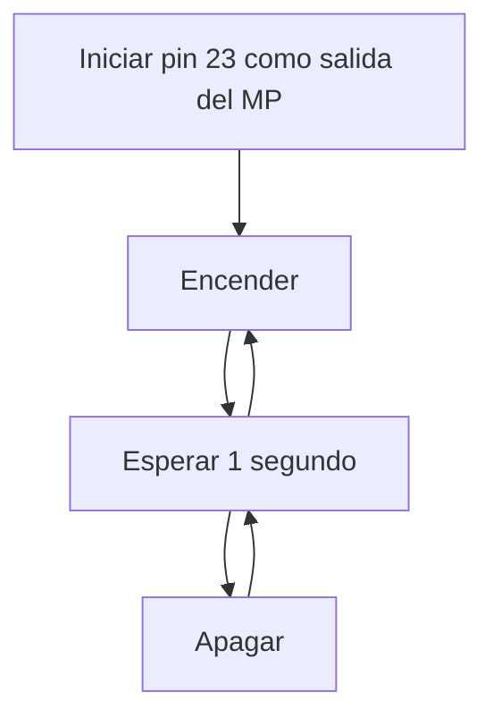

# PR1_EricAyala

## PRACTICA 1: BLINK 💡

1. **### Generar el programa y subir el código al GitHub de cada uno.**
2. **Modificar el programa para que incluya el envío de datos (ON y OFF) al puerto serie. Añadir la inicialización del puerto serie y el envío cada vez que cambia el estado del LED.**
    - Iniciar pin de LED como salida.
    - Iniciar el terminal serie.
    - **Bucle infinito:**
        - Encender LED.
        - Sacar por puerto serie mensaje ON.
        - Espera de 1000 milisegundos.
        - Apagar LED.
        - Sacar por puerto serie mensaje OFF.
        - Espera de 1000 milisegundos.

### CODIGO:
```cpp
#include <Arduino.h>

int LED_BUILTIN = 23; 

void setup() {               
 pinMode(LED_BUILTIN, OUTPUT); 
 Serial.begin(115200);  
}

void loop() {
 digitalWrite(LED_BUILTIN, HIGH);  
 delay(500);
 Serial.println("ON");
 
 digitalWrite(LED_BUILTIN, LOW);    
 delay(500); 
 Serial.println("OFF"); 
}

```
# 4.Medición de Frecuencia de Encendido y Apagado sin Delays

Para determinar la máxima frecuencia de encendido y apagado que permite el microcontrolador, se eliminarán los delays y se modificará el pin de salida. Se medirá esta frecuencia en cuatro casos diferentes:

1. **Con Envío por Puerto Serie Utilizando Funciones de Arduino**

``` cpp
  void loop() {
     digitalWrite(led, HIGH);   // turn the LED on
     Serial.println("ON"); //puerto serie sacar ON
     digitalWrite(led, LOW);    // turn the LED off
     Serial.println("OFF"); //puerto serie sacar OFF
    }

  ```

 - digitalwrite y println (delay: 0,5ms) --> 930Hz

2. **Con Envío por Puerto Serie Accediendo Directamente a los Registros**

``` cpp
  uint32_t *gpio_out = (uint32_t *)GPIO_OUT_REG;
  
  void loop() {
     Serial.println("ON");
     *gpio_out |= (1 << led);
     Serial.println("OFF");      
     *gpio_out ^= (1 << led);
    }

  ```

 - reg y println (delay: 0,5ms) --> 930Hz
 
3. **Sin Envío por Puerto Serie Utilizando Funciones de Arduino**

``` cpp
  void loop() {
     digitalWrite(led, HIGH);   // turn the LED on
     digitalWrite(led, LOW);    // turn the LED off
    }

  ```

 digitalwrite sin println (delay: 0,5ms) --> 992Hz

4. **Sin Envío por Puerto Serie Accediendo Directamente a los Registros**

``` cpp
  uint32_t *gpio_out = (uint32_t *)GPIO_OUT_REG;

  void loop() {
     *gpio_out |= (1 << led);
     *gpio_out ^= (1 << led);
    }

  ```
 con reg sin println (delay: 0,5ms) --> 992Hz

# 5. DIAGRAMA DE FLUJO


